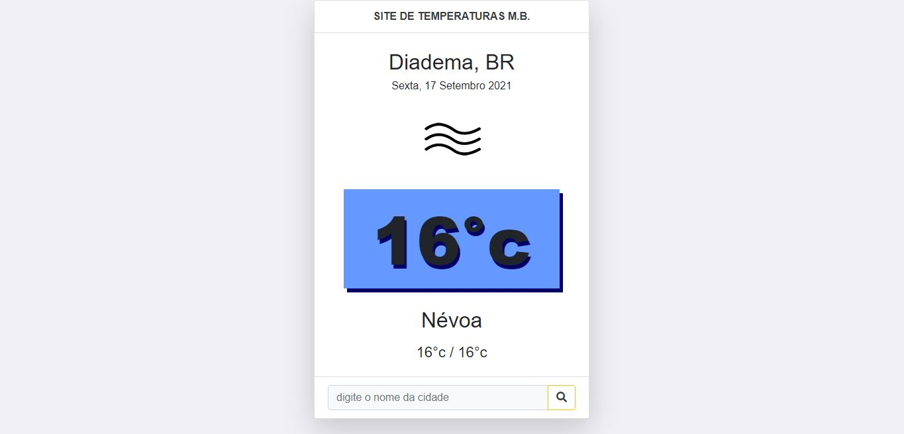

# TemperaturaAPI
Projeto de consumo de fetch API de Temperatura/Clima

## **Solicitado:**

A equipe deve criar uma API dos temas apresentados.  
Tema escolhido: **Previsão do Tempo**

## **Organização:**
A equipe decidiu que todos iriam participar do processo de criação da API. 
Seguimos o seguinte tutorial: https://www.youtube.com/watch?v=PbwJfG2u4zI&t=19s  
Estilizamos da forma que preferimos e fizemos o upload.

## **Visão da Página:**

